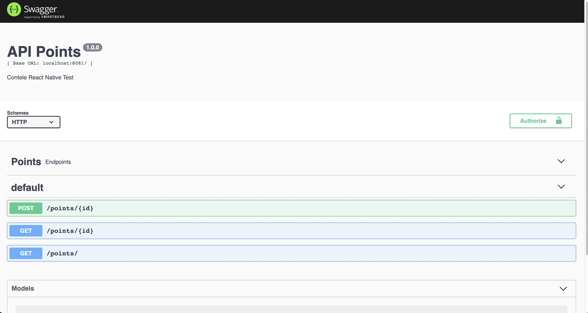
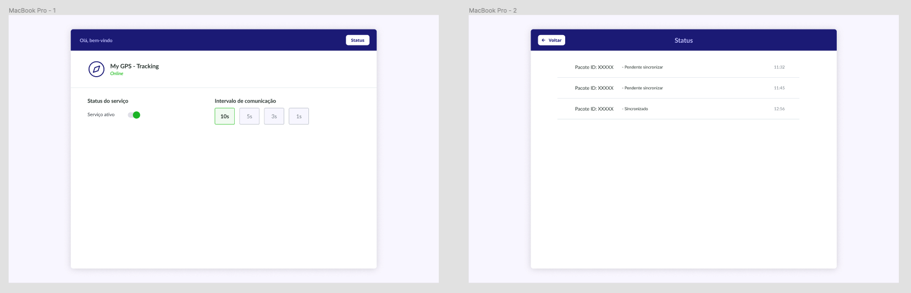

# contele testes automatizados

  

## Sobre a CONTELE

  Empresa do ramo de tecnologia, com forte atuação no mercado nacional em processo expansão Internacional. Projeto fixo, não é temporário. Projetos desafiadores e oportunidade de crescimento.

Confira um vídeo com uma explicação melhor sobre a empresa: [https://youtu.be/GusemhFLxMo](https://youtu.be/GusemhFLxMo)

## desejávelRequisitos mínimos de hardware e software para a VAGA

### Hardware

- Memória: 8GB de RAM
- Processador i5 ou algum AMD equivalente. 

### Software
- Docker
- NodeJS
- NVM ( geranciador de versões para NodeJS, pois trabalhamos com versões diferentes em vários projetos ) 
- Client para Database  -  Desejável que seja o Dbeaver.
- Editor de texto - Desejável que seja o vscode. 
- Sistema Operacional - Desejável que seja alguma distribuição Linux. 

### Para vagas de APP - React Native, desejável ter MACOS

### Teste para Testes automatizados

Objetivo deste teste é avaliar suas habilidades em desenvolvimento de testes automatizados para APIs e FrontEnd

### O Desafio

Na Contele trabalhamos bastante com geolocalização. Seguindo essa ideia, seu desafio é criar dois Testes automatizados: Um teste da API para garantir que ela esteja funcionando, e um teste automatizado para o FrontEnd que trabalhará a lógica de sincronização de informações. O que seria essa sincronização? criar pacotes e enviar para um servidor.

Nesse repositório disponibilizamos um ambiente com os endpoints para salvar os pacotes, buscar informações do pacote e listar os pacotes.

Para subir o ambiente, executar os seguintes comandos:

```
npm install
```

```
docker-compose up --build
```

Para acessar a documentação dos endpoints, basta acessar a URL: http://localhost:8081/doc



Segue a imagem do site para aplicar a solução:



### Requisitos

* Conhecimento com HTMl/Javascript
* Conhecimento básico em NodeJS
* Conhecimento com Cypress/Jest ou similares
  
### O que apreciamos

* README.md
* Testes automatizados da API/FrontEnd
* Fluxo e resultado dos testes feitos 
* Código limpo e bem organizado

### Finalizando

* Suba a sua proposta para o projeto que você criou no GitHub. Exemplo: https://github.com/seuNome/test-AutomatedTests.git;

* Aguarde o RH entrar em contato.

### Quem buscamos  

Queremos uma pessoa que gosta do que faz, que trabalhe em equipe e tenha vontade de inovar. Sempre buscando atualização e soluções inovadoras.

Venha fazer parte do nosso time!