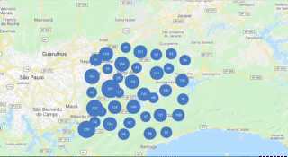

# contele js-pleno

## Sobre a CONTELE

Empresa do ramo de tecnologia, com forte atuação no mercado nacional em processo expansão Internacional. Projeto fixo, não é temporário. Projetos desafiadores e oportunidade de crescimento.

Confira um vídeo com uma explicação melhor sobre a empresa: [https://youtu.be/GusemhFLxMo](https://youtu.be/GusemhFLxMo)

### Teste NodeJS

O objetivo deste teste é avaliar seus conhecimentos em organização, boas práticas e suas habilidades de programação.

### Requisitos

* HTML/CSS/JavaScript
* React
* NodeJS
* Docker
* Swagger API
* Google Maps

### O Desafio

O objetivo é desenvolver uma página bem simples utilizando o Maps Javascript API para plotar os Markers(Pontos) no mapa. A Contele irá disponibilizar 50 mil pontos via JSON e você deverá plotar esses locais no mapa, mas o desafio será também fazer agrupamento dos pontos no Mapa.

Segue o JSON: [http://images.contelege.com.br/poi.json](http://images.contelege.com.br/poi.json)

### O que apreciamos

* README.md
* Mapa do Google Maps
* Locais no mapa vindo do JSON
* HTML máximo possível semântico
* CSS bem estruturado
* Código limpo e bem organizado
* Agrupamento dos locais

### Finalizando

* Suba a sua proposta para o projeto que você criou no GitHub. Exemplo: https://github.com/seuNome/test-NodeJSPleno.git;
* Aguarde o RH entrar em contato.

### Quem buscamos

Queremos uma pessoa que gosta do que faz, que trabalhe em equipe e tenha vontade de inovar. Sempre buscando atualização e soluções inovadoras.

Venha fazer parte do nosso time!