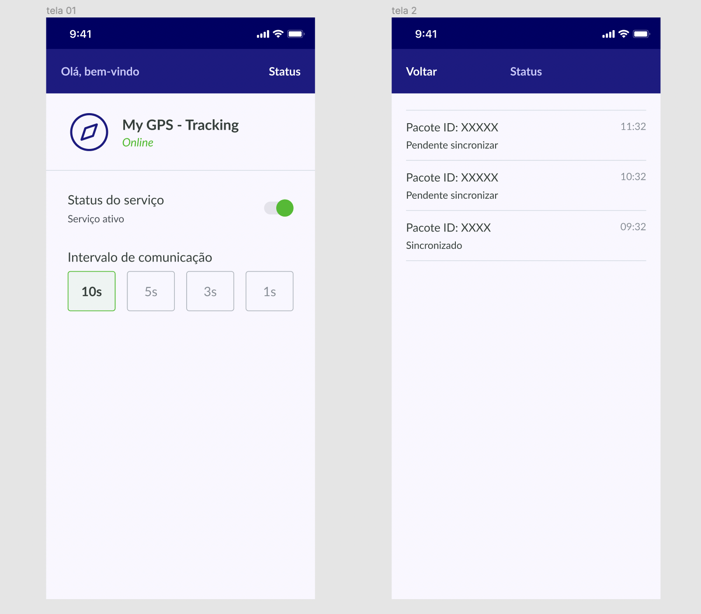

# contele react-native

  

## Sobre a CONTELE

  Empresa do ramo de tecnologia, com forte atuação no mercado nacional em processo expansão Internacional. Projeto fixo, não é temporário. Projetos desafiadores e oportunidade de crescimento.

Confira um vídeo com uma explicação melhor sobre a empresa: [https://youtu.be/GusemhFLxMo](https://youtu.be/GusemhFLxMo)

### Teste para React Native

Objetivo deste teste é avaliar seus conhecimentos em organização, estilo, boas práticas e habilidades em desenvolvimento de app.

### O Desafio

Na Contele trabalhamos bastante com geolocalização, dentro desse contexto, a gente diversos problemas com área de sombra(offline). Seguindo essa ideia, seu desafio é criar um Aplicativo para obter a localização do celular e trabalhar a lógica de sincronização de informações. O que seria essa sincronização, criar pacotes e enviar para um servidor, simulando o ambiente offline para guardar os pontos e quando estiver online, enviar para o servidor.

Nesse repositório disponibilizamos um ambiente com os endpoints para salvar os pacotes, buscar informações do pacote e listar os pacotes. 

Para subir o ambiente, executar os seguintes comandos:

```
npm install
```

```
docker-compose up --build
```

Para acessar a documentação dos endpoints, basta acessar a URL: http://localhost:8081/doc


Segue a imagem do aplicativo para aplicar a solução:



### Requisitos

  
* React Native
* React Native 0.60+
* Redux ou Hooks
* Geolocalização (obter localização)
* Sincronização 
* Offline
  
### O que apreciamos

* README.md
* Código limpo e bem organizado
* Android e iOS

### Finalizando
* Suba a sua proposta para o projeto que você criou no GitHub e nos envie o link.
* Exemplo: https://github.com/seuNome/test-ReactNative.git;
* Aguarde o RH entrar em contato.

## Requisitos mínimos de hardware e software para a VAGA
### Hardware

- Memória: 8GB de RAM
- Processador i5 ou algum AMD equivalente. 

### Software
- Docker
- NodeJS
- NVM ( geranciador de versões para NodeJS, pois trabalhamos com versões diferentes em vários projetos ) 
- Client para Database  -  Desejável que seja o Dbeaver.
- Editor de texto - Desejável que seja o vscode. 
- Sistema Operacional - Desejável que seja alguma distribuição Linux.

### Para vagas de APP - React Native, desejável ter MACOS

### Quem buscamos  

Queremos uma pessoa que gosta do que faz, que trabalhe em equipe e tenha vontade de inovar. Sempre buscando atualização e soluções inovadoras.

Venha fazer parte do nosso time!